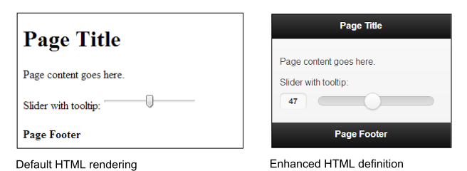
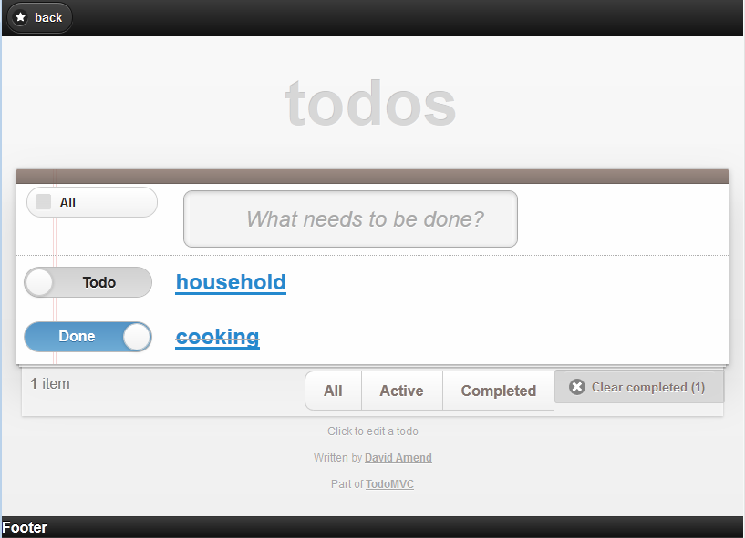
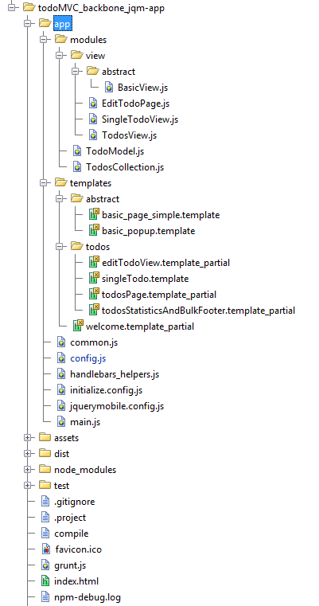
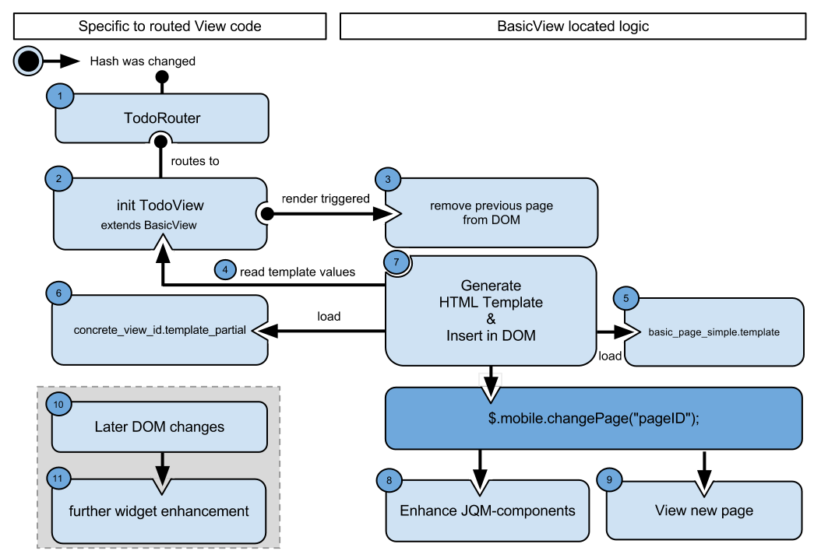
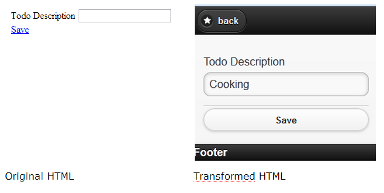
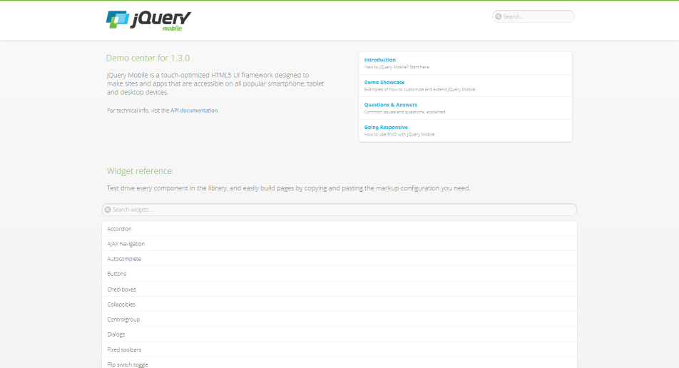
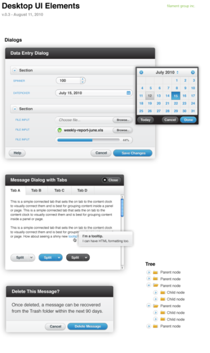
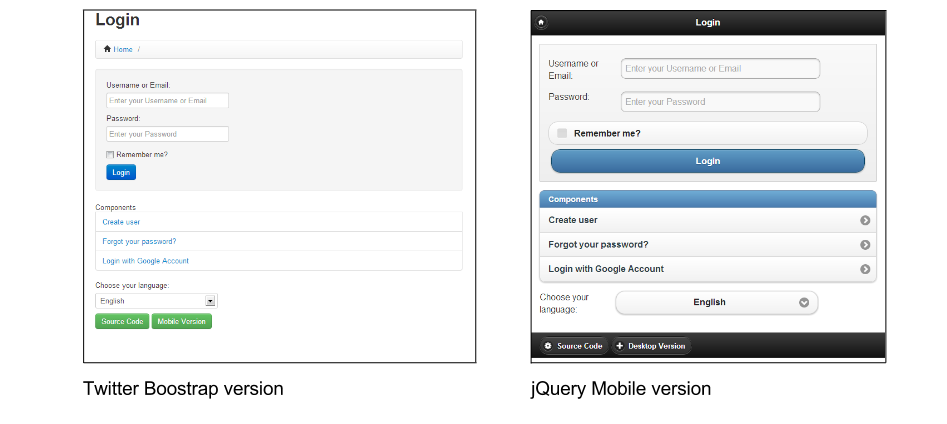

## Backbone & jQuery Mobile

### Mobile app development with jQuery Mobile

The mobile web is huge and it is continuing to grow at an impressive rate. Along with the massive growth of the mobile internet comes a striking diversity of devices and browsers. As a result, making your applications cross-platform and mobile-ready is both important and challenging.
Creating native apps is expensive.
It is very costly in terms of time and it usually requires varied experiences in programming languages like Objective C , C#, Java and JavaScript to support multiple runtime environments.

HTML, CSS, and JavaScript enables you to build an app only once. Because of the common runtime environment, the browser, it supports a broad band of mobile devices such as tablets, smartphones, notebooks or PCs.

The challenging task is not only to adopt contents like text and pictures properly to various screen resolutions but also to have same user experience across native apps by different operating systems.
Like jQueryUI, jQuery Mobile is a user interface framework, based on jQuery that works across all popular phones, tablet, e-Reader, and desktop platforms. Built with accessibility and universal access in mind. 


The main idea of the framework is to enable anybody creating mobile apps, even without the knownledge of a programming language and no need to write complex, device specific CSS, but HTML only.
For this reason jQMobile follows two main principles, we first need to understand to be able to integrate the framework to Backbone.


#### 1. The Principle of progressive widget enhancement by jQMobile

JQuery Mobile follows the <b>progressive enhancement</b> and <b>responsive web design</b> principle by <b>HTML-5 markup-driven definitions</b> and <b>configurations</b>.

A page in jQuery Mobile consists of an element with a <b>data-role="page"</b> attribute.
Within the <b>page</b> container, any valid HTML markup can be used, but for typical pages in jQM, the immediate children are divs with <b>data-role="header"</b>, <b>data-role="content"</b>, and <b>data-role="footer"</b>.
The baseline requirement for a page is only the page wrapper to support the navigation system, the rest is optional.

A initial HTML page looks like:

```html
<!DOCTYPE html>
<html>
<head>
	<title>Page Title</title>

	<meta name="viewport" content="width=device-width, initial-scale=1">

	<link rel="stylesheet" href="http://code.jquery.com/mobile/1.3.0/jquery.mobile-1.3.0.min.css" />
	<script src="http://code.jquery.com/jquery-1.9.1.min.js"></script>
	<script src="http://code.jquery.com/mobile/1.3.0/jquery.mobile-1.3.0.min.js"></script>
</head>
<body>

<div data-role="page">
  <div data-role="header">
    <h1>Page Title</h1>
  </div>
  <div data-role="content">
     <p>Page content goes here.</p>
     <form>
       <label for="slider-1">Slider with tooltip:</label>
       <input type="range" name="slider-1" id="slider-1" min="0" max="100" value="50" 
        data-popup-enabled="true">
     </form>
  </div>
  <div data-role="footer">
     <h4>Page Footer</h4>
  </div>
</div>
</body>
</html>
```

<i>Example HTML setup of a basic jQuery Mobile page</i>
<br />

JQuery Mobiles will transform the written HTML definition by the <b>progressive widget enhancement API</b> to HTML and CSS.
It also executes JavaScript, conditioned by configurations, attribute properties and runtime specific settings.

This implies: Whenever HTML content is added or changed, it need to be handled by the progressive widget enhancement of jQuery Mobile.



<i>Comparison of the user interface of the default HTML to the jQuery Mobile enhanced version</i>
<br />
#### 2. Understand the navigation of jQueryMobile


The navigation system controls its application lifecycle by automatically "hijacking" standard links and form submissions and turning them into an AJAX request.
Whenever a link is clicked or a form is submitted, that event is automatically intercepted and is used to e.g. issue an AJAX request based on the href or form action, instead of reloading the page.

When the page document is requested, jQuery Mobile searches the document for all elements with the <b>data-role="page"</b> attribute, parses its contents and inserts that code into the DOM of the original page.
After the new page is prepared, the JavaScript of jQuery Mobile will trigger a transition to show the new page and hides the HTML of the previous page in the DOM.

Next, any widgets in the incoming page are enhanced to apply all the styles and behavior. The rest of the incoming page is discarded so any scripts, stylesheets or other information will not be included.

Roughly speaking, having its own event cycle, it is a tiny MVC framework which enables features like
<b>progressive widget enhancement, prefetching, caching and multi-page templating by HTML configurations</b>,innately.
In general, the developer does not need to know about its event-workflow, but only about how to apply HTML based configurations, which will take action within the event phase.
The chapter <b>Intercept jQuery Mobile events</b> goes into detail, how to handle special scenarios, when fine grained JavaScript adaptions need to be applied.


To e.g. navigate to the <b>secondpage</b> with the appearance of a modal dialog and render a fade-transition, add the <b>data-rel="dialog"</b>, <b>data-transition="fade"</b> and <b>href="index.html#secondpage"</b> attributes to the anchor tag.

Via the <b>multi-page templating feature</b>, you can add as many pages as you want to the same HTML file within the body-tag,
by defining a div with <b>data-role="page"</b> or <b>data-role="dialog"</b> and the <b>id</b>, being the value of the link after the hashbang:


```html
<html>
  <head>...</head>
  <body>
  ...
  <div data-role="page" id="firstpage">
    ...
   <div data-role="content"> 
     <a href="#secondpage">go to secondpage</a>
   </div>
  </div>
  <div data-role="page" id="secondpage">
    ...
    <div data-role="content" >
       <a href="#firstdialog" data-rel="dialog" >open a page as a dialog</a>
    </div>
  </div>
  <div data-role="dialog" id="firstdialog">
    ...
     <div data-role="content">
       <a href="#firstpage">leave dialog and go to first page</a>
     </div>
  </div>
</body>
</html>
```

<i>Example to show multipage templating of jQuery Mobile</i>
<br />

For further introduction and explanations about jQuery Mobile visit:

http://view.jquerymobile.com/1.3.0/docs/intro/
http://view.jquerymobile.com/1.3.0/docs/widgets/pages/
http://view.jquerymobile.com/1.3.0/docs/intro/rwd.php

### Basic Backbone app setup for jQuery Mobile

Throughout <b>Developing Backbone.js Applications</b> content, we learned how to use and benefit from the <b>Backbone-Router, -Views, -Events</b> and <b>-Model</b>, such as advanced plugins and customized JavaScript programming.

The first major hurdle developers typically run into when building applications with jQuery Mobile and a M* framework is that they have their own opinions about how to handle application navigation.
The same is true for Backbone.

To combine Backbone and jQuery Mobile, we first need to <b>disable</b> the <b>navigation system</b> and the <b>progressive enhancement</b> of jQuery Mobile.
The second step will be to make usage of the custom API of jQM to apply configurations and enhance components by different techniques in the application lifecycle of Backbone.

The mobile app example presented in the following is build upon the existing codebase of the <b>TodoMVC Backbone-Require.js</b>, which is usedin the chapter <b>Modular Development</b> as well, and is enhanced to support jQuery Mobile.



<i>Screenshot of the TodoMVC app with jQuery Mobile</i>
<br />
Apart from that it makes use of Grunt-BBB as well as Handlebars.js. Additional utilities useful for mobile applications will be provided, which can be easily combined and extended.
( see chapter <b>Backbone Boilerplate & Grunt-BBB</b> and the <b>Throrax</b>-chapter) 



<i>Workspace of the TodoMVC app with jQueryMobile and Backbone</i>
<br />

The initial order of the files to load by Require.js is as follows:

1. <b>jQuery</b>
2. <b>Underscore/Lodash</b>
3. <b>handlebars.compiled</b>
4. <b>TodoRouter</b>, instantiates specific views
5. <b>jQueryMobile</b>
6. <b>JqueryMobileCustomInitConfig</b>
7. Instantiation of the Backbone Router

By opening the console in the project directory and running the Grunt-Backbone command <b>grunt handlebars</b> or <b>grunt watch</b> in the console, 
it will combine and compile all template files to <b>dist/debug/handlebars_packaged</b>. To start the application, run <b>grunt server</b>.

<br />
Files instantiated, when redirected from the Backbone-Router are:

a) <b>BasicView.js</b> and <b>basic_page_simple.template</b>
   <p>The BasicView is responsible for the Handlebars multipage-template processing.
   Last, it calls the jQuery Mobile API <b>$.mobile.changePage</b>, when <b>Backbone.View.render</b> is applied 
   to handle page navigation and progressive widget enhancement.</p>
   
b) <b>Concrete view with its template partial</b>
   E.g. <b>EditTodoPage.js</b> and <b>editTodoView.template_partial</b>


The head of <b>index.html</b> needs to load the <b>jquerymobile.css</b> as well as the <b>base.css</b>,
which is being used by all Todo-MVC apps, and the <b>index.css</b> for some project specific custom CSS.

```html
<html>
<head>
    <meta charset="utf-8">
    <meta http-equiv="X-UA-Compatible" content="IE=edge,chrome=1">
    <meta name="viewport" content="width=device-width,initial-scale=1">

    <title>TodoMVC Jquery Mobile</title>

<!-- widget and responsive design styles -->
    <link rel="stylesheet" href="/assets/css/jquerymobile.css">
<!-- used by all TodoMVC apps -->
    <link rel="stylesheet" href="/assets/css/base.css">
<!-- custom css -->
    <link rel="stylesheet" href="/assets/css/index.css">
</head>

<body>
    <script data-main="/app/config" src="/assets/js/libs/require.js"></script>
</body>
</html>
```

<i>Code of <b>index.html</b></i>

### The workflow with Backbone and jQueryMobile

By delegating routing and navigation functionalities of the jQuery Mobile Framework to Backbone, we can profit from its clear separation of application structure to later on easily share application logic between a desktop webpage, tablets and mobile apps.

<b>Backbone.Router</b> offers an explicit way to define custom navigation routes. Whilst jQuery Mobile encourages the use of URL hash fragments to reference separate pages or views in the same document.
Some of the ideas that have been previously proposed to work-around this problem included manually patching Backbone and jQuery Mobile.

The solution demonstrated below, will not only simplify the handling of the jQuery Mobile component initialization event-cycle, but also enables the usage of the existing Backbones Router functionalities.

To adopt the navigation control from jQuery Mobile to Backbone, we first need to apply some specific setting to the <b>mobileinit</b> event, after the framework was loaded to e.g. let the Backbone Router decide, which page to load.

A suggested configuration with its descriptions to delegate jQM navigation and to enable manual widget creation triggering to Backbone is listed below:

```javascript
$(document).bind("mobileinit", function(){

// Disable jQM routing and component creation events   
   // disable hash-routing
   $.mobile.hashListeningEnabled = false;
   // disable anchor-control
   $.mobile.linkBindingEnabled = false;
   // can cause calling object creation twice and back button issues are solved
   $.mobile.ajaxEnabled = false;
   // Otherwise after mobileinit, it tries to load a landing page
   $.mobile.autoInitializePage = false;
   // we want to handle caching and cleaning the DOM ourselves
   $.mobile.page.prototype.options.domCache = false;

// consider due to compatibility issues
   // not supported by all browsers
   $.mobile.pushStateEnabled = false;
   // Solves phonegap issues with the back-button
   $.mobile.phonegapNavigationEnabled = true;
   //no native datepicker will conflict with the jQM component
   $.mobile.page.prototype.options.degradeInputs.date = true;
});
```

<i>Code of <b>jquerymobile.config.js</b></i>

The behaviour and usage of the new workflow will be explained, grouped by its functionalities:

a) <b>Routing to a concrete View-page</b>

b) <b>Management of mobile page templates</b>

c) <b>DOM management</b>

d) <b>$.mobile.changePage</b>


For an overview and understanding the chronological order, have a look on the diagram below.
In the following, the <b>steps 1-11</b> are attached to the text and refer to the new workflow diagram of the mobile application.



<i>Workflow of TodoMVC, with Backbone and jQueryMobile</i>

####Routing to a concrete View-page, inherited by BasicView

Whenever the hash URL has changed, e.g. by clicking the link, the configuration prevented jQM to trigger its events. Instead, the Backbone Router listens to the hash changes and decides which view to request.

However, experience has shown that, it is a good practice for mobile pages, to create basic anatomies by prototyping for various situations like a basic page,
the usage of the <b>jQuery Validation Plugin</b>, <b>popups</b> or <b>dialogs</b> with jQM.

Then it becomes much easier to exchange device specific view logics, at runtime, and adopt general strategies-
This would also help to add syntax and to support multi chaining of prototype inheritance with JavaScript and Backbone.
By creating a <b>BasicView-superclass</b>, we enable all inherited-view-pages to share a common way to handle jQM the common usage of a template engine and specific view handling.

In the build progress of Grunt/Yeoman, the semantic templates will be compiled by Handlebar.js and the AMDs template files are combined into a single file.
By merging all page definitions into a single-file-app, it becomes offline capable, which is important for mobile app.


#### Management of mobile page templates

Within a concrete View-page, you can override properties for static values and functions to return dynamic values of the super class <b>BasicView</b>.
These values will be later on processed by the BasicView to construct the HTML of a jQuery Mobile page with the help of Handlebars.

Additional dynamic template parameters e.g. Backbone Model information, will be taken from the specific View and merged with the ones from the BasicView.

A concrete View might look like:

```javascript
define([
    "backbone", "modules/view/abstract/BasicView"],
    function (Backbone, BasicView) {
        return BasicView.extend({
            id : "editTodoView", 
            getHeaderTitle : function () {
                return "Edit Todo";
            },
            getSpecificTemplateValues : function () {
                return this.model.toJSON();
            },
            events : function () {
// merged events of BasicView, to add an older fix for back button functionality
                return _.extend({
                    'click #saveDescription' : 'saveDescription'
                }, this.constructor.__super__.events);
            },
            saveDescription : function (clickEvent) {
                this.model.save({
                    title : $("#todoDescription", this.el).val()
                });
                return true;
            }
        });
    });
```

<i>Sample of a concrete View, <b>EditTodoPage.js</b></i>


By default, the BasicView uses the <b>basic_page_simple.template</b> as the Handlebars template.
if you need a custom template, being used only once, 
or in the case you want to create a new Super-abstract-View, like the basic_page_simple, override the <b>getTemplateID</b> function.

```javascript
getTemplateID : function(){
  return "custom_page_template";
}
```

By convention, the overridden <b>id</b>-attribute will be taken as the id of the jQM page
as well as the filename of the corresponding template-file to be inserted as a partial in the <b>basic_page_simple</b> template.
In the case of the <b>EditTodoPage</b>-View, the name of the file will be <b>editTodoPage.template_partial</b>.
Every concrete page is meant to be a partial, which will be inserted in the <b>data-role="content"</b> element,
where the parameter <b>templatePartialPageID</b> is located.

Later on, the <b>getHeaderTitle</b> function from the <b>EditTodoPage</b> will be replaced in the abstract template with <b>headerTitle</b>.


```javascript
<div data-role="header">
        {{whatis "Specific loaded Handlebars parameters:"}}
        {{whatis this}}
        <h2>{{headerTitle}}</h2>
        <a id="backButton" href="href="javascript:history.go(-1);" data-icon="star" data-rel="back" >back</a>
    </div>
    <div data-role="content">
        {{whatis "Template page trying to load:"}}
        {{whatis templatePartialPageID}}
        {{> templatePartialPageID}}
    </div>
    <div data-role="footer">
        {{footerContent}}
</div>
```

<i>Code of <b>basic_page_simple.template</b></i>


The <b>whatis</b> Handlebars View helper does simple logging of parameters.


All the additional parameters being returned by <b>getSpecificTemplateValues</b> 
will be replaced in the concrete template <b>editTodoPage.template_partial</b>.
Because <b>footerContent</b> is expected to be used rarely, it can be returned in <b>getSpecificTemplateValues</b>.

In the case of the EditTodoPage View, all the model information is being returned,
where <b>title</b> is used in the concrete partial page.


```html
<div data-role="fieldcontain">
    <label for="todoDescription">Todo Description</label>
    <input type="text" name="todoDescription" id="todoDescription" value="{{title}}" />
</div>
    <a id="saveDescription" href="#" data-role="button" data-mini="true">Save</a>
```

<i>Code of editTodoView.template_partial</i>


When <b>render</b> is triggered, the <b>basic_page_simple.template</b> and <b>editTodoView.template_partial</b> templates will be loaded 
and the collected parameters from <b>EditTodoPage</b> and <b>BasicView</b> will be combined and generated by Handlebars to:

```html
    <div data-role="header">
        <h2>Edit Todo</h2>
        <a id="backButton" href="href="javascript:history.go(-1);" data-icon="star" data-rel="back" >back</a>
    </div>
    <div data-role="content">
      <div data-role="fieldcontain">
       <label for="todoDescription">Todo Description</label>
       <input type="text" name="todoDescription" id="todoDescription" value="Cooking" />
      </div>
      <a id="saveDescription" href="#" data-role="button" data-mini="true">Save</a>
    </div>
    <div data-role="footer">
        Footer
    </div>
```

<i>Final HTML definition result of the Handlebars templating, basic_page_simple_template and editTodoView.template_partial</i>

The next section explains, how the template parameters are collected by the <b>BasicView</b> and the HTML definition is loaded.


#### DOM management and $.mobile.changePage

When <b>render</b> is executed, <b>BasicView</b> will first clean up the DOM, by removing the previous page in <b>line 70</b>.
To delete the elements from the DOM, <b>$.remove</b> cannot be used, but <b>$previousEl.detach()</b>.
<b>Detach</b> does not remove the elements attached events and data.
This is important, because jQuery Mobile still needs information to e.g.
trigger transition effects when switching to another page.
Have in mind, that the DOM data and events should be cleared later on as well due to possible performance lacking.

Other strategies than the one used in the function <b>cleanupPossiblePageDuplicationInDOM</b> to cleanup the DOM are applicable.
To only remove the old page having the same id than the current from the DOM, when it was already requested before,
would also be a working strategy of preventing DOM duplication. Depending on what fits best to your application needs,
it is also possible a one-banana problem to exchange it with a caching mechanism.

Next, <b>BasicView</b> will collect all template parameters from the concrete View implementation
and inserts the HTML of the requested page into the body.
This is done in <b>steps 4, 5, 6</b> <b>and 7</b> and between <b>line 23</b> and <b>51</b>.

Additional, the <b>data-role</b> will be set on the jQuery Mobile page. Common used attribute values are
<b>page</b>, <b>dialog</b> or <b>popup</b>.

As you can see, in <b>line 74</b>, it also contains a manual implementation to handle the back buttons action.
In special scenarios, the back button navigation functionality of jQuery Mobile was not working with older versions and disabled jQMobiles navigation sytem.


```javascript
 1 define([
 2     "lodash",
 3     "backbone",
 4     "handlebars",
 5     "handlebars_helpers"
 6 ],
 7 
 8 function (_, Backbone, Handlebars) {
 9     var BasicView = Backbone.View.extend({
10         initialize: function () {
11             _.bindAll();
12             this.render();
13         },
14         events: {
15             "click #backButton": "goBackInHistory"
16         },
17         role: "page",
18         attributes: function () {
19             return {
20                 "data-role": this.role
21             };
22         },
23         getHeaderTitle: function () {
24             return this.getSpecificTemplateValues().headerTitle;
25         },
26         getTemplateID: function () {
27             return "basic_page_simple";
28         },
29         render: function () {
30             this.cleanupPossiblePageDuplicationInDOM();
31             $(this.el).html(this.getBasicPageTemplateResult());
32             this.addPageToDOMAndRenderJQM();
33             this.enhanceJQMComponentsAPI();
34         },
35 // Generate HTML by the Handlebars templates
36         getTemplateResult: function (templateDefinitionID, templateValues) {
37             return window.JST[templateDefinitionID](templateValues);
38         },
39 // Collect all template paramters and merge them
40         getBasicPageTemplateResult: function () {
41             var templateValues = {
42                 templatePartialPageID: this.id,
43                 headerTitle: this.getHeaderTitle()
44             };
45             var specific = this.getSpecificTemplateValues();
46             $.extend(templateValues, this.getSpecificTemplateValues());
47             return this.getTemplateResult(this.getTemplateID(), templateValues);
48         },
49         getRequestedPageTemplateResult: function () {
50             this.getBasicPageTemplateResult();
51         },
52         enhanceJQMComponentsAPI: function () {
53 // changePage
54             $.mobile.changePage("#" + this.id, {
55                 changeHash: false,
56                 role: this.role
57             });
58         },
59 // Add page to DOM
60         addPageToDOMAndRenderJQM: function () {
61             $("body").append($(this.el));
62             $("#" + this.id).page();
63         },
64 // Cleanup DOM strategy
65         cleanupPossiblePageDuplicationInDOM: function () {
66         // Can also be moved to the event "pagehide": or "onPageHide"
67             var $previousEl = $("#" + this.id);
68             var alreadyInDom = $previousEl.length >= 0;
69             if (alreadyInDom) {
70                 $previousEl.detach();
71             }
72         },
73 // Strategy to always support back button with disabled navigation
74         goBackInHistory: function (clickEvent) {
75             history.go(-1);
76             return false;
77         }
78     });
79 
80     return BasicView;
81 });
```

<i>Code of BasicView.js</i>

After the dynamic HTML is added to the DOM, <b>$.mobile.changePage</b> has to be applied at <b>step 8</b> and <b>code line 54</b>.

It is the most important API call, because it triggers the jQuery Mobile component creation of the current page.

Next, the page will be displayed to the user at <b>step 9</b>.


```javascript
<a data-mini="true" data-role="button" href="#" id="saveDescription" data-corners="true" 
data-shadow="true" data-iconshadow="true" data-wrapperels="span" data-theme="c" 
class="ui-btn ui-shadow ui-btn-corner-all ui-mini ui-btn-up-c">
    <span class="ui-btn-inner">
         <span class="ui-btn-text">Save</span>
     </span>
</a>
```



<i>Look and feel of the written HTML code and jQuery Mobile enhanced, Todo description page</i>

<br />
UI enhancement is done in the enhanceJQMComponentsAPI function in line 52:

```javascript
$.mobile.changePage("#" + this.id, {
                      changeHash: false,
                      role: this.role
                    });
```

To retain control of hash routing, <b>changeHash</b> has to be set to false as well as the proper <b>role</b>-parameter to guarantee proper page appearance.
Finally, <b>changePage</b> will show the new page with its defined transition to the user.

For the basic use cases, it is advised, to have one View per page, and always render again the complete page by calling <b>$.mobile.changePage</b> when widget enhancement needs to be done.

To progress component enrichment of a newly added HTML-fragment into the DOM, advanced techniques need to be applied, to guarantee correct appearance of the mobile components.
You have to be very careful, when creating partial HTML code and updating values on UI elements.
The next section will explain how to handle such situations.


### Applying advanced jQM techniques to Backbone

#### Dynamic DOM Scripting


The solution described above solves the issues of handling routing with Backbone by calling $.mobile.changePage('pageID').
Additionally, it is guaranteed, that the HTML page will be completely enhanced by the markup of jQuery Mobile.

The second tricky part with jQuery Mobile is to dynamically manipulate specific DOM contents (e.g. after loading in content with Ajax).
We suggest you use this technique, only if there is evidence for an appreciable performance gain.
With the current version 1.3, jQM provides three ways, documented and explained below in the official API, on forums and blogs.


* <b>$(“pageId”).trigger(“pagecreate”)</b>
  <p>Creates markup of header, content as well as footer</p>
* <b>$(“anyElement”).trigger(“create”)</b>
  <p>Creates markup of the element as well as all children</p>
* <b>$(“myListElement”).listview(“refresh”)</b>
  <b>$('[type="radio"]').checkboxradio()</b>
  <b>$('[type="text"]').textinput()</b>
  <b>$('[type="button"]').button()</b>
  <b>$('[data-role="navbar"]').navbar()</b>
  <b>$('[type="range"]').slider()</b>
  <b>$('select').selectmenu()</b>
  <p>Every component of jQM offers plugins methods to
    update the state of specific UI elements.
    Sometimes, when creating a component from scratch, the following error can occur 'cannot call methods on listview prior to initialization'.
    This can be avoided, with component initialization prior to markup enhancement, by calling it in the following way:
    <b>$('#mylist').listview().listview('refresh')</b>
  </p>

To see more details and enhancements for further scripting pages of JQM read their API and follow the release notes, frequently.

http://jquerymobile.com/test/docs/pages/page-scripting.html

http://stackoverflow.com/questions/14468659/jquery-mobile-document-ready-vs-page-events/ 

http://stackoverflow.com/questions/14550396/jquery-mobile-markup-enhancement-of-dynamically-added-content

<br />
If you consider using a <b>Model-Binding Plugin</b>, you will need to come up with an automated mechanism to enrich single components.

After having a look on the previous section about <b>Dynamic DOM Scripting</b>,
it might not be acceptable, to completely recreate a component (e.g a Listview), which takes longer time to load and to reduce the complexity of event-delegation.
Instead, the component specific plugins, which will only update the needed parts of the HTML and CSS, should be used.
In the case of a Listview, you would need to call the following function to update the list of added, edited, or removed entries:

```javascript
$('#mylist').listview()
```

You need to come up with a detection of the component type to decide which plugin method needs to be called. The jQuery Mobile Angular.js Adapter provides such a strategy and solution as well.

https://github.com/tigbro/jquery-mobile-angular-adapter/blob/master/src/main/webapp/integration/jqmWidgetPatches.js, Example of Model Binding with jQuery Mobile


#### Intercept jQuery Mobile events

In special situations you will need to to take action to a triggered jQuery Mobile event, which can be done like this:

```javascript
$('#myPage').live('pagebeforecreate', function(event){
         console.log(page was inserted into the DOM');
   	//run your own enhancement scripting here...
          // prevent the page plugin from making its manipulations
  	return false;
});

$('#myPage').live('pagecreate', function(event){
          console.log(‘page was enhanced by jQM');
});
```

In such scenarios, it is important to know when the jQuery Mobile events occur. The following diagram and the API depicts the event-cycle.


<i> Original event cycle of jQuery Mobile </i>

An alternative is the jQuery Mobile Router project, which you might need to replace with the Backbone Router. With the help of jQM-Router project,
you could achieve a powerful way to intercept and route one of the various jQM events.
It is an extension to jQuery Mobile, which can be used independenly.
Have in mind, that jQM-Router misses some features of Backbone.Router and is tight coupled with the jQuery Mobile framework.
For these reasons, we dismissed it for the TodoMVC app.
If you intend to use it, consider <b>Backbone.js Custom Builds</b> to exclude the router code. This might save ~ 25%, out of the max compressed size of 17,1 KB.

http://gregfranko.com/backbone/customBuild/, Backbones Custom Builder


#### Performance

Performance is a sensible topic on mobile devices.
jQuery Mobile provides various tools, to create performance logs, which gives you a good overview about the actual time spend to routing logic, component enhancement, and visual effects.

Depending on the device, the time spend on transitions can take <b>up to 90% load time</b>. To disable transitions all over, you can eighter pass the transition <b>none</b> to <b>$.mobile.changePage()</b>, in the configuration code block:

```javascript
$(document).bind("mobileinit", function(){
…
// Otherwise, depending on takes up to 90% of loadtime
  $.mobile.defaultPageTransition = "none";
  $.mobile.defaultDialogTransition = "none";
    });
  })
```

consider to add device specific settings, which can be achieved like: 

```javascript
$(document).bind("mobileinit", function(){

  var iosDevice =((navigator.userAgent.match(/iPhone/i))
  || (navigator.userAgent.match(/iPod/i))) ? true : false;

  $.extend(  $.mobile , {
    slideText :  (iosDevice) ? "slide" : "none",
    slideUpText :  (iosDevice) ? "slideup" : "none",
    defaultPageTransition:(iosDevice) ? "slide" : "none",
    defaultDialogTransition:(iosDevice) ? "slide" : "none"
  });
```

Also, think about coming up with your own <b>precaching of enhanced jQuery Mobile pages</b>.
The API of jQuery Mobile is frequently enriched with every new release around these topic.
We suggest you to have a look on the updated API to optimal achieve a caching strategy with dynamic scripting,
which fits to your needs, best.

See further information on performance at:

https://github.com/jquery/jquery-mobile/tree/master/tools, jQuery Mobile Profiling Tools

http://backbonefu.com/2012/01/jquery-mobile-and-backbone-js-the-ugly/, Device specific jQuery Mobile configuations

http://www.objectpartners.com/2012/11/02/use-jquery-mobile%E2%80%99s-tools-suite-to-help-you-debug-and-improve-your-jquery-mobile-application/, jQuery Mobile Debugging tools

http://jquerymobile.com/demos/1.2.0/docs/pages/page-cache.html, jQuery Mobile precaching functionalities


#### Clever multi platform support management by DRY


The reality is that we do not always have the scope to create per-device experiences, so today's application will attempt to optimize the devices or browsers most likely to access it.
It is essential, that the content the application exposes, is readily available to all users, regardless of what browser they are accessing it from, so this principle will be kept in mind during the design phase.

The mobile app architecture, presented in this chapter, simplifies a lot of the actual heavy lifting, as it supports responsive layouts, out of the box and even supports browsers, which cannot handle media queries.
It might be not obvious, that jQM is a UI framework not dissimilar to jQuery UI. jQuery Mobile is using the widget factory and is capable for being used for more than just widgets for mobile environments.

Nowadays, usually a webpage already exists, and the management decides to serve a mobile app on top to the customers.
The code of the webpage and the app become independant of each other. The time needed to spend on content or feature changes, are much higher.

But the trend is towards an increasing number of mobile applications and its dimensions, so does the effort to manage the applications for various devices.
The additional time to spend on handling changes in your app for the next years, is depending on your architectural choice.

The <b>Responsive Design</b> and <b>Mobile First</b> approaches address these challenges. 

(see http://www.lukew.com/ff/entry.asp?933 and http://www.abookapart.com/products/mobile-first)


To support multi platform browsers by the usage of jQuery Mobile and Backbone,
you can, descending by increasing time effort:

1. Ideally, <b>one code project</b>, where only CSS differs for different devices.
2. Same code project, and at runtime, different HTML templates
   and super-classes are exchanged per device type.
3. Same code project, and the Responsive Design API and most widgets of jQuery Mobile will be reused.
   For the desktop browser, some components will be added by another widget framework
   e.g. <b>jQueryUI</b> or <b>Twitter Boostrap</b>, e.g. controlled by the HTML templating.
4. Same code project, and at runtime, jQuery Mobile will be completely replaced 
   by another widget framework e.g. <b>jQueryUI</b> or <b>Twitter Boostrap</b>.
   Super-classes and configurations, as well as concrete Backbone.View code snippets need to be replaced.
5. <b>Different code projects</b>, but common modules are reused.
6. For the desktop app, there is a completely separate code project.
   Reasons might be the usage of complete different programming languagages
   and/or frameworks, lack of Responsive Design knownledge or legacy of pollution.
<br />

The architectural solution, to build a nice looking desktop application with only one mobile framework, sounds crazy, but is feasible.

If you have a look at the <b>jQuery Mobile API page</b> in a desktop browser, it does not look anything like a mobile application.



<i>Desktop view of the jQuery Mobile API and Docs application, http://view.jquerymobile.com/1.3.0/ </i>
<br />

The same goes for the jQuery Mobile design examples, where jQuery Mobile intends to add further user interface experiences.



<i>Design examples of jQuery Mobile for desktop environments, http://jquerymobile.com/designs/#desktop</i>
<br />

The accordeons, date-pickers, sliders - everything in the desktop UI is re-using what jQM would be providing users on mobile devices.
By way of example, adding the attribute <b>data-mini="true"</b> on components, will lose the clumsiness of the mobile widgets on a desktop browser.

See http://jquerymobile.com/demos/1.2.0/docs/forms/forms-all-mini.html, Mini widgets for e.g. desktop applications by jQuery Mobile.

Thanks to some media queries, the desktop UI can make optimal use of whitespace,
expanding component blocks out and providing alternative layouts whilst still making use of jQM as a component framework.


The benefit of this is that you don’t need to go pulling in another widget framework e.g.jQuery UI separately to be able to take advantage of these features.
Thanks to the recent ThemeRoller the components can look pretty much exactly how I would like them to and users of the app can get a jQM UI for lower-resolutions and a jQM-ish UI for everything else.

The takeaway here is just to remember that if you are not already going through the hassle of conditional script/style loading based on screen-resolution (using matchMedia.js etc), there are simpler approaches that can be taken to cross-device component theming.
At least the <b>Responsive Design API</b> of jQuery Mobile, which was added since version 1.3.0, is always reasonable, 
because it will work for mobile as well as for desktop. Summarized, you can manage jQuery Mobile components to give users a typical desktop appereance. They will not realize a difference.

http://view.jquerymobile.com/1.3.0/docs/intro/rwd.php, Responsive Design with jQuery Mobile.

<br />

Also, if you <b>hit your limits of CSS-styling and configurations</b> of your jQuery Mobile application for desktop browsers,
the additional effort to use <b>jQuery Mobile</b> and <b>Twitter Boostrap</b>, together, can be quite simple.
In the case a desktop browser requests the page and Twitter Boostrap is loaded, the used <b>mobile TodoMVC app</b>, would need conditional code to not trigger the 
<b>jQM Widget processive enhancement plugins API</b> (demonstrated in section <b>Dynamic DOM Scripting</b>) in the <b>Backbone.View</b> implementation.
Therefore, as explained in the previous sections, we recommand to only trigger widget enhancements by <b>$.mobile.changePage</b>, once to load the complete page.

An example of such a widget hybrid usage can be seen here:



<i>Appengine boilerplate, desktop and mobile appereance http://appengine.beecoss.com </i>
<br />

Although, it is using server-side technologies for templating by the programming language Python,
the principle of triggering progressive enhancement at pageload, is the same as <b>$mobile.changePage</b>.

As you can see, the JavaScript and even the CSS stays the same.
The one and only device specific conditions and differences in implementations, are about switching the appropriate imported frameworks,
which are located in the HTML template:

```html
...
 
    <link rel="stylesheet" href="/mobile/jquery.mobile-1.1.0.min.css" />
    
      <link rel="apple-touch-icon" href="/apple-touch-icon.png" />
      <link rel="stylesheet" href="/css/style.css" />
      <link rel="stylesheet" href="/css/bootstrap.min.css">
      <link rel="stylesheet" href="/css/bootstrap-responsive.min.css">
    
      <link rel="stylesheet" href="/css/main.css" />

    
...
 
      <script src="/mobile/jquery.mobile-1.1.0.min.js"></script>
    
      <script src="/js/libs/bootstrap.min.js"></script>
    
...
```


